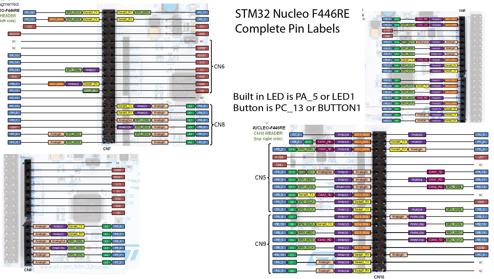
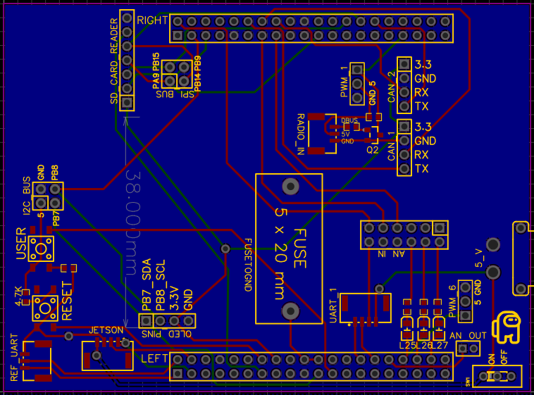
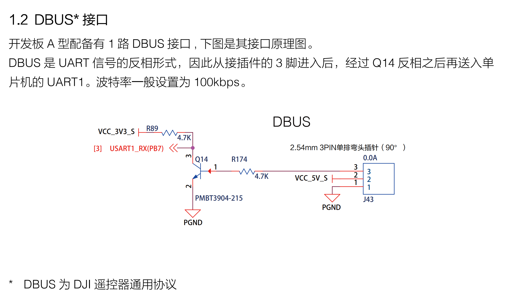

# Docs
A file containing useful documentation, datasheets, pinouts, and links

## Boards
[NUCLEO-F446RE](https://os.mbed.com/platforms/ST-Nucleo-F446RE/)

## Remote
<a href="http://dl.djicdn.com/downloads/dt7/en/DT7&DR16_RC_System_User_Manual_v2.00_en.pdf" target="_blank" rel="noopener noreferrer">Remote and receiver</a> 

## Motors
<a href="https://rm-static.djicdn.com/tem/17348/RoboMaster GM6020 Brushless DC Motor User Guide.pdf" target="_blank">GM6020 Motor</a> 
<a href="https://rm-static.djicdn.com/tem/17348/RoboMaster M3508 P19 Brushless DC Gear Motor V1.0.pdf" target="_blank">M3508 Motor</a> 
<a href="https://rm-static.djicdn.com/tem/17348/RM M2006 P36直流无刷减速电机使用说明.pdf" target="_blank">M2006 Motor</a> 
<a href="https://rm-static.djicdn.com/tem/17348/RoboMaster Snail 2305 Brushless DC Motor User Guide.pdf" target="_blank">SNAIL (2305)</a> 

## ESCs
<a href="https://rm-static.djicdn.com/tem/17348/RoboMaster C620 Brushless DC Motor Speed Controller V1.01.pdf" target="_blank">C620 ESC</a> 
<a href="https://rm-static.djicdn.com/tem/17348/RoboMaster C610 Brushless DC Motor Speed Controller User Guide.pdf" target="_blank">C610 ESC</a> 
<a href="https://rm-static.djicdn.com/tem/17348/RoboMaster C615 Brushless DC Motor Speed Controller User Guide.pdf" target="_blank">C615 ESC</a> 

## Images

