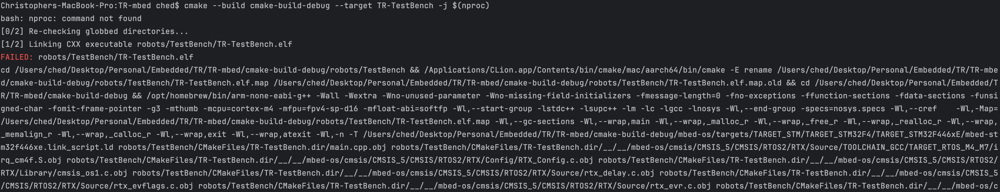
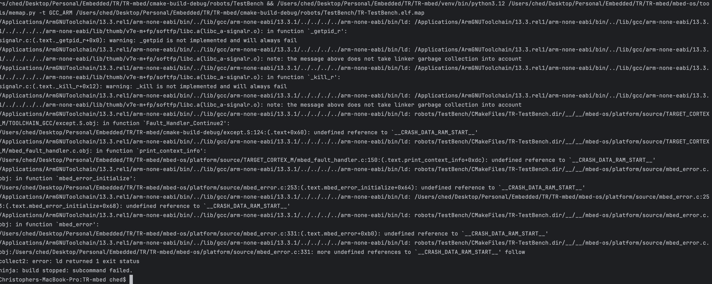
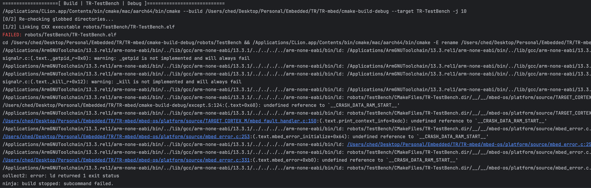

### Compilation Errors
General compilation errors pertaining to a `mbed` failure usually correlates to a missing header file.
This can be fixed by removing build and IDE caches:
```shell
# Remove IDE specific caches
rm -rf .idea/ .vscode/

# Remove build folders
rm -rf mbed-os/ cmake_build/
```

Re-configure and build the project as dictated by the [Setup](../README.md#setup) guide.

### OpenOCD

If OpenOCD fails with the error `Error: libusb_open() failed with LIBUSB_ERROR_ACCESS`, you may need to add a `udev` rule
to allow OpenOCD to access the ST-Link programmer:

```shell
cd /etc/udev/rules.d

# Download openocd udev rules
sudo wget https://raw.githubusercontent.com/openocd-org/openocd/master/contrib/60-openocd.rules

# Reload udev rules
sudo udevadm control --reload
```

### STM32 Nucleo Status Lights:

Solid Light green: Nucleo is disconnected

- Power Cycle

Solid Red Light: Nominal

Blinking Red Light: Not enough voltage

### `collect2: error: ld returned 1 exit status` error

If you are getting errors like these when trying to use CLI build commands: 
`cmake -S . -B cmake-build-debug -GNinja`, and
`cmake --build build --target TR-<target> -j $(nproc)`.

...


or errors like this when trying to run in CLion via OpenOCD:


There’s a good chance the executables, namely the `TR-<target>.elf` file, is being generated somewhere else and the script cannot find it.

Do a file search for the `TR-<target>.elf` file and see if it exists. If you have both a `/build` and a `/cmake-build-debug` folder in your root `/TR-mbed`  directory with nearly the exact same file structures, then the proper `.elf` file may be getting generated in the `/build` folder instead of the `/cmake-build-debug` folder that the script is targeting.

The fix for this is to just change the target folders in the commands to the folders where the `TR-<target>.elf` is. For example, change the CLI commands to:
`cmake -S . -B build -GNinja`, and
`cmake --build build --target TR-<target> -j $(nproc)`. Note that if you're using a Makefile to run commands, you have to change the target pathnames from `cmake-build-debug` to `build` in there too.

We have not found a fix to change the OpenOCD script.
