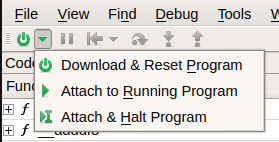
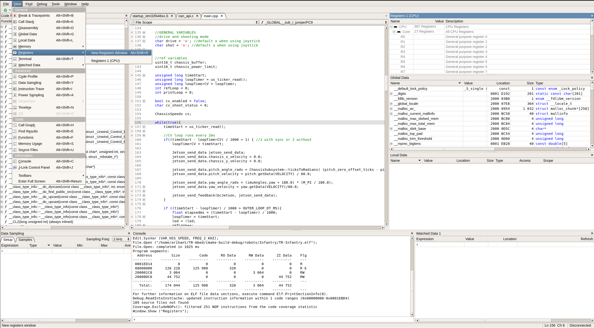

# Debugging with Ozone

## Step 1

First, you need to install the [Ozone Debugger](https://www.segger.com/downloads/jlink/#Ozone)

## Step 2

To debug with Ozone, you need to open the Ozone debugger, then create a new project.

## Step 3

In devices, you should select the STM32F446RE device, then press Next:

## Step 4

Now, for the Connection settings, select SWD as the Target Interface, USB as the Host Interface, and 4MHz as the Interface Speed

## Step 5

Finally, select the correct .elf file from your cmake-build-debug folder in the repository to configure Ozone

## Step 6

Press Finish since we do not need to change the Optional Settings. Congrats, you have the Ozone Debugger set up!

## Step 7

To debug your stack while the robot is running, I advise flashing the JLink with Ozone open to ensure a secure connection to the device.

## Step 8

Then, you should click the arrow next to the power button on the top left of the Ozone Window to select Attach to Running Program.

## Step 9

You can then use the "View" window to open up various windows. The Memory, Global, Local and Watched Data and the Registers Windows show information about the current state and content of the target.

## Step 10

Use the Watched Data Window to specify certain local or global data to trace and plot the current value, or use the Data Sampling window to track and export values.