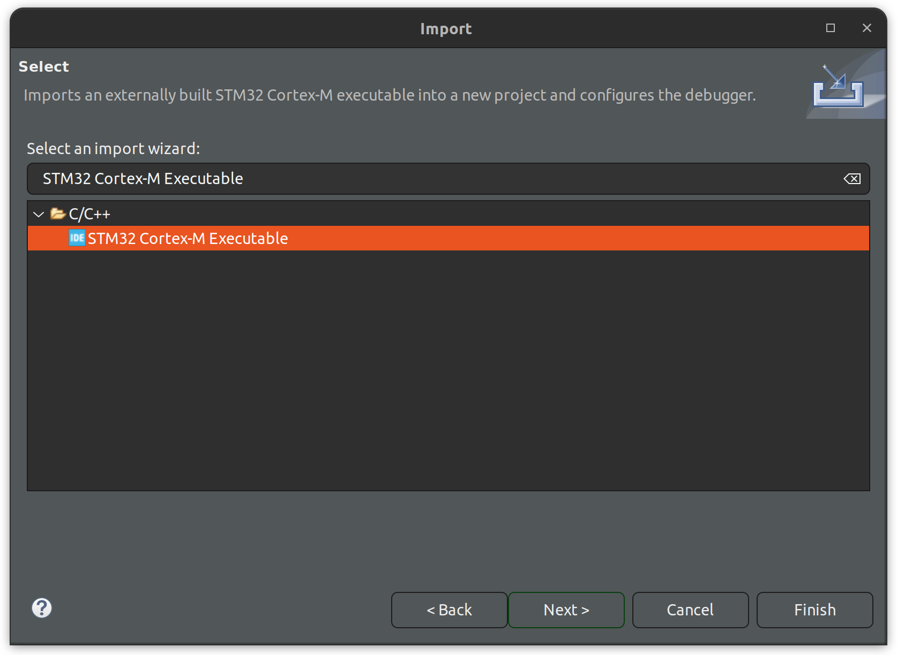
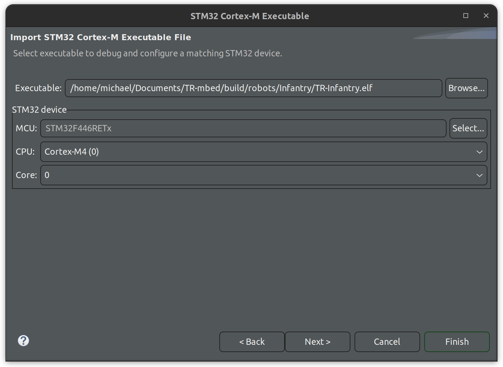
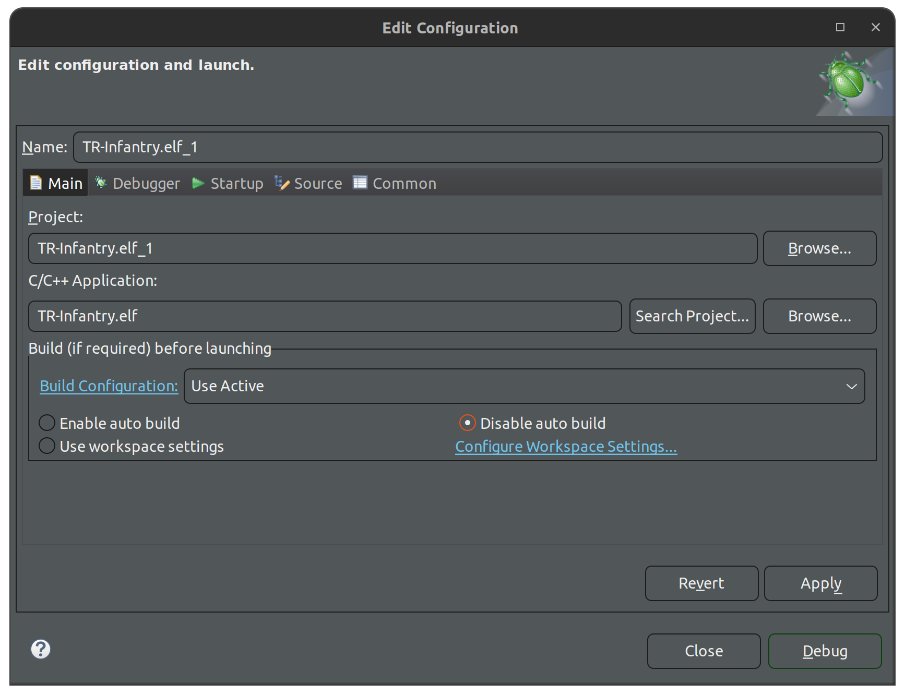

# Debugging

This guide details how to use STM32CubeIDE to run the debugger using the Nucleo's built-in STLink in-circuit debugger

## Step 1

Install [STM32CubeIDE](https://www.st.com/en/development-tools/stm32cubeide.html)

## Step 2

Hook up your nucleo using the USB cable, build and flash the TR-mbed codebase. Find the resulting binary, it should be something like `TR-mbed/build/robots/[ROBOT HERE]/TR-[ROBOT HERE].elf`

## Step 3

Launch STM32CubeIDE. Click File > Import and search for the "STM32 Cortex-M Executable" import wizard. Click "Next >"

## Step 4

Click "Browse..." and select the binary you built in step 2. Click the "Select..." button on the side and search for the device "STM32F446RETX." The menu should look like this when you're done:

Click Finish once you're done.

## Step 5

Everything should be set up, you can now click "Debug." At this point in time, the IDE may prompt you to update the ST Link firmware version for the board you are using, it should automatically open the update dialog for you.

## Step 6

Debug! If you need to debug in a file that doesn't automatically open when you launch the debugger, go to "File > Open File..." and open it.