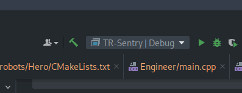

1. Open project by selecting the root `CMakeLists.txt` in your desired IDE. CLion
will automatically run the configure step.

2. Upon opening the project, ensure the `CMake` directory is set to:

    `cmake-build/NUCLEO_F446RE/develop/GCC_ARM`.

   1. If for whatever reason this does not appear upon project open, the same menu can be reached
   via `CTRL + ALT + S` and searching for `CMake`.

3. Edit your targets by navigating to `Run > Edit Configurations...`. Remove unneeded
targets by selecting multiple at a time:

4. Ensure the desired robot is selected in your IDE:

5. Build using your IDE.