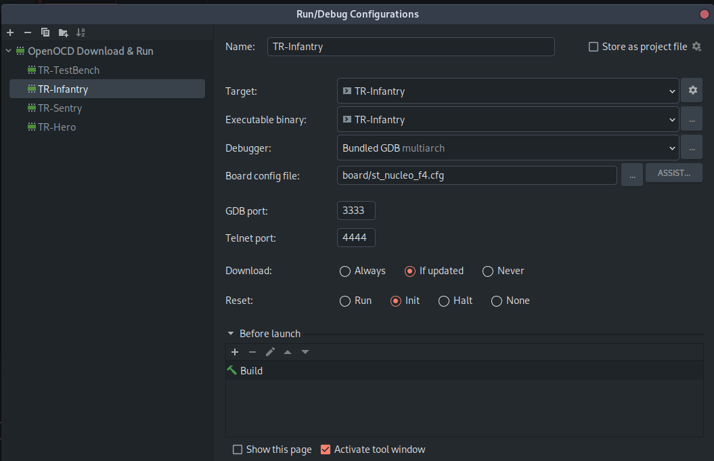

1. Open project by selecting the root `CMakeLists.txt` in your desired IDE. CLion
will automatically run the configure step.


2. Upon opening the project, ensure the `CMake` directory is set to:

    `cmake_build/NUCLEO_F446RE/develop/GCC_ARM`.

   1. If for whatever reason this does not appear upon project open, the same menu can be reached
   via `CTRL + ALT + S` and searching for `CMake`.


3. Edit your targets by navigating to `Run > Edit Configurations...`. Remove unneeded
targets by selecting multiple at a time:


4. Add a new `OpenOCD` configuration:


5. Configure the desired target as shown:

   1. Note that this process will have to be repeated a few times for each robot target



6. Ensure the desired robot is selected in your IDE:


7. Build and run using your IDE. Ensure board is connected before running.

   Expected output is similar to the following:
```
...
** Programming Started **
Info : device id = 0x10006421
Info : flash size = 512 kbytes
** Programming Finished **
...
shutdown command invoked
```

If OpenOCD fails with the error `Error: libusb_open() failed with LIBUSB_ERROR_ACCESS`, you may need to add a `udev` rule
to allow OpenOCD to access the ST-Link programmer:

```shell
cd /etc/udev/rules.d

# Download openocd udev rules
sudo wget https://raw.githubusercontent.com/openocd-org/openocd/master/contrib/60-openocd.rules

# Reload udev rules
sudo udevadm control --reload
```

8. Install the following plugin to view serial output:


9. Navigate to `Tools > Serial Port Monitor > Settings` and select the correct serial port and baud rate:


10. Open the serial port monitor by navigating to `Tools > Serial Port Monitor > /dev/ttyACM0` and observe the output.
    1. You may have to disable the "Hex View" option for cleaner output:

