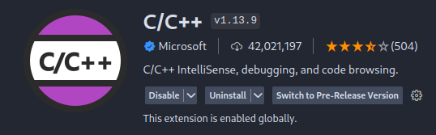
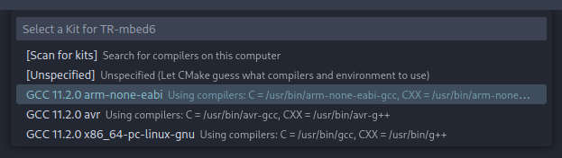
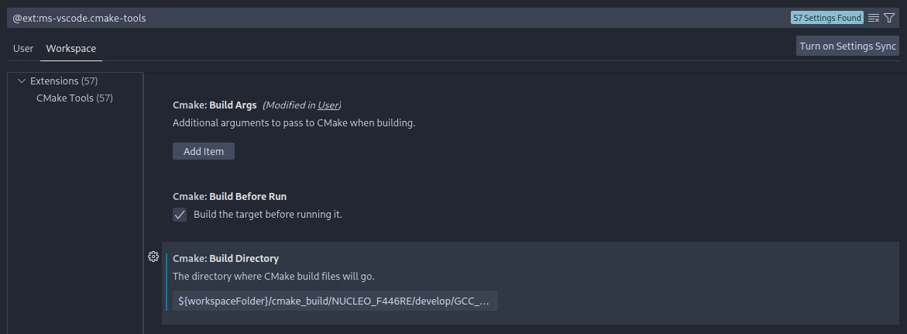
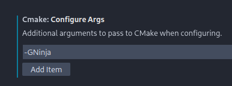
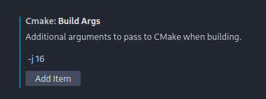
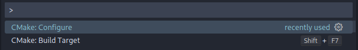
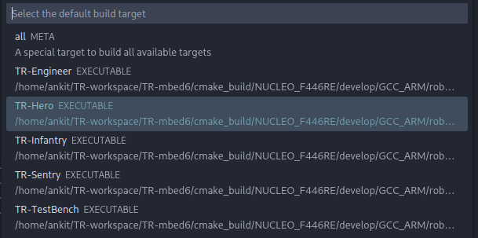

1. Ensure the following VSCode extensions are installed:




2. Open the project folder. Upon opening the folder, you will have to select the correct
   compiler as shown:



3. Locate the CMake-Tools extension settings using `CTRL + <Comma>`. Change your **workspace** variables to reflect the
   build directory `${workspaceFolder}/cmake_build/NUCLEO_F446RE/develop/GCC_ARM`:



Optional: Add the following arguments to enable the Ninja build tool to speed up compile
times. Note that you may have to change the `-j 16` arg to the number of processes your CPU
can handle, which can be found via the `nproc` command.




5. Use `CTRL + SHIFT + P` to open the command palette, then select `C/C++: Edit Configurations (JSON)`.
   Append the following to your `c_cpp_properties.json`

```json
{
    "configurations": [
        {
            "name": "CMake",
            "compileCommands": "${config:cmake.buildDirectory}/compile_commands.json",
            "configurationProvider": "ms-vscode.cmake-tools"
        }
    ],
    "version": 4
}
```

6. Use `CTRL + SHIFT + P` to open the command palette, then select `CMake: Configure`. The
   configure step should only be run once per project, or after editing any `CMakeLists.txt`.



7. Open the command palette, then select `CMake: Build Target`.
   You will be prompted to choose a target, as shown below:



8. I have not found a good VSCode plugin to flash an STM32 board via `OpenOCD`. I encourage VSCode users to append the
necessary instructions to this guide. For now, I recommend flashing the board via the command line:

```shell
openocd -f board/st_nucleo_f4.cfg -c "program cmake_build/NUCLEO_F446RE/develop/GCC_ARM/robots/Sentry/TR-Sentry.elf verify reset exit"

mbed-tools sterm -b 115200
```