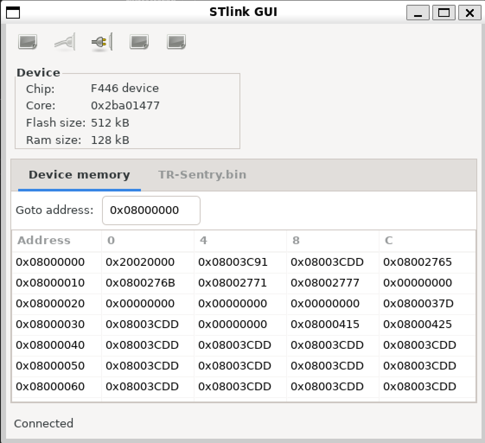

```
  __________                        __             __
 /_  __/ __ \            ____ ___  / /_  ___  ____/ /
  / / / /_/ /  ______   / __ `__ \/ __ \/ _ \/ __  / 
 / / / _, _/  /_____/  / / / / / / /_/ /  __/ /_/ /  
/_/ /_/ |_|           /_/ /_/ /_/_.___/\___/\__,_/   
                                                     
```

## Prerequisites

The following setup guide is written assuming Ubuntu. This setup guide is applicable to other 
operating systems, but may take additional setup (i.e. WSL for Windows, or HomeBrew for MacOS).

```shell
sudo apt install    \
  build-essential   \
  cmake             \
  python3-dev       \
  python3-pip       \
  gcc-arm-none-eabi \
  openocd           \
  ninja-build
```

Use pip to install `mbed` and various dependencies:
```shell
pip install   \
  mbed-tools  \
  prettytable \
  future      \
  jinja2      \
  intelhex
```

In `~/.bash_profile`, append the following to enable `mbed-tools` via command line:
```shell
export PATH="${PATH}:/home/${USER}/.local/bin"
```

Optional: Extra dependencies for compiling micro-ros:
```shell
pip install   \
  catkin_pkg  \
  lark-parser \
  empy        \
  colcon-common-extensions
```
---
## Setup
1. Clone this repo:
```shell
git clone https://github.com/Triton-Robotics/TR-mbed.git
```

2. Navigate to project root directory and initialize `mbed` project:
```shell
cd TR-mbed && mbed-tools deploy
```

3. Configure project for `CMake`:
```shell
mbed-tools configure -m NUCLEO_F446RE -t GCC_ARM
```

**Optional: At this point, you may choose to diverge from the CLI setup guide and set up an IDE
instead. Check out the setup instructions for [CLion](.readme/clion.md) or [VSCode](.readme/vscode.md).**

4. Configure `CMake` project. This should only be done once per project, or after editing
any `CMakeLists.txt`:

```shell
cmake -S . -B cmake_build/NUCLEO_F446RE/develop/GCC_ARM -GNinja
```

5. Build the desired target using your IDE or via CLI:

```shell
cmake --build cmake_build/NUCLEO_F446RE/develop/GCC_ARM --target TR-Sentry -j $(nproc)
```

Viable targets for build are: `TR-Engineer`, `TR-Infantry`, `TR-Sentry`, `TR-Hero`, and `TR-TestBench`

6. Locate the generated executable:

    eg. The built executable for Sentry will be present in `cmake_build/NUCLEO_F446RE/develop/GCC_ARM/robots/Sentry/TR_Sentry.elf`


7. Flash the executable to the target device and open a serial terminal:

   1. For flashing device in WSL, see the [Appendix](#appendix-wsl-steps)

```shell
openocd -f cfg/st_nucleo_f4.cfg -c "program cmake_build/NUCLEO_F446RE/develop/GCC_ARM/robots/Sentry/TR-Sentry.elf verify reset exit"

mbed-tools sterm -b 115200
```
---
## Appendix: WSL Steps

Author: Michael Owens

Flashing is where WSL begins to diverge from normal Linux. We have to pass through the USB device to WSL and then make sure we have the right installer.
1. Follow [this guide](https://learn.microsoft.com/en-us/windows/wsl/connect-usb#attach-a-usb-device) to install `usbipd-win`
2. Start windows powershell / windows terminal (not cmd, don't be cringe) and try running `usbipd list`. The output should look something like this:
```
PS C:\Users\legor> usbipd list
Connected:
BUSID  VID:PID    DEVICE                                                        STATE
2-3    0b05:19b6  USB Input Device                                              Not shared
3-2    0483:374b  ST-Link Debug, USB Mass Storage Device, USB Serial Device...  Attached
3-3    13d3:56eb  USB2.0 HD UVC WebCam, USB2.0 IR UVC WebCam, Camera DFU De...  Not shared
4-1    0489:e0e2  MediaTek Bluetooth Adapter                                    Not shared
```
3. We can see here that the bus id of the st link programmer for the board is `3-2`, so we should run `usbipd wsl attach --busid 3-2` (replace the busid with yours)

4. Finally, open your WSL shell. Run `lsusb`, the output should look like this, and now we know WSL has the device connected.
```
ubuntu@AAAAAAAAA:~/TR-mbed6$ lsusb
Bus 002 Device 001: ID 1d6b:0003 Linux Foundation 3.0 root hub
Bus 001 Device 003: ID 0483:374b STMicroelectronics ST-LINK/V2.1
Bus 001 Device 001: ID 1d6b:0002 Linux Foundation 2.0 root hub
```
5. Install the open source install `stlink-tools`. You can read more about the project [here](https://github.com/stlink-org/stlink)
```shell
sudo apt install stlink-tools stlink-gui
```
6. Note when running the stlink tools you must have root perms, so write `sudo stlink-gui`. Try running `sudo st-info --probe` to get a list of attatched programmers:
```shell
ubuntu@AAAAAAAAA:/usr/local/share$ sudo st-info --probe
Found 1 stlink programmers
 serial: 303636464646353535303731343934383637313830373335
openocd: "\x30\x36\x36\x46\x46\x46\x35\x35\x35\x30\x37\x31\x34\x39\x34\x38\x36\x37\x31\x38\x30\x37\x33\x35"
  flash: 0 (pagesize: 0)
   sram: 0
 chipid: 0x0000
  descr: unknown device
```
7. Now we can flash the board. Use `sudo stlink-gui`, and select the bin file generated in `cmake_build/NUCLEO_F446RE/develop/GCC_ARM/robots/Sentry/TR_Sentry.bin` or similar depending on your target, hit connect, then flash.


###