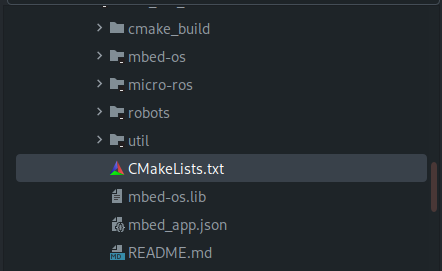
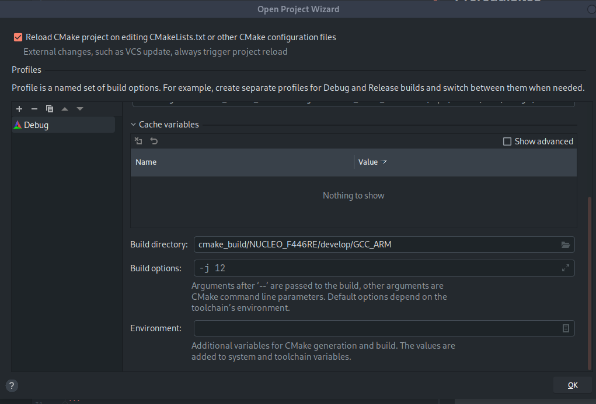
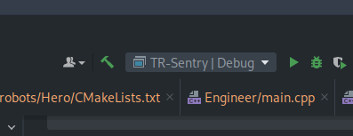

## Prerequisites

Assuming Ubuntu:

```shell
sudo apt install \
  python3-dev \
  python3-pip \
  gcc-arm-none-eabi \
  ninja-build
```

Use pip to install `mbed`:
```shell
pip install mbed-tools
```

Extra dependencies for compiling micro-ros (Optional):
```shell
pip install \
  catkin_pkg \
  lark-parser \
  empy \
  colcon-common-extensions
```
---
## Setup
1. Clone this repo:
```shell
git clone <add link here later>
```

2. Initialize `mbed` project:
```shell
mbed-tools deploy
```

3. Configure project for `CMake`:
```shell
mbed-tools configure -m NUCLEO_F446RE -t GCC_ARM
```

3. Open project by selecting the root `CMakeLists.txt` in your desired IDE.
   
    Alternatively, skip to step 6 for CLI usage. 



4. Upon opening the project, ensure the `CMake` directory is set to the following:



5. Ensure the desired robot is selected in your IDE:



6. Build the desired target using your IDE or via CLI:
```shell
cd cmake_build/NUCLEO_F446RE/develop/GCC_ARM && cmake .
cd <project root dir> && cmake --build cmake_build/NUCLEO_F446RE/develop/GCC_ARM --target TR-Sentry -j 12
```

7. Locate the generated binary:

    eg. The built binary for Sentry will be present in `cmake_build/NUCLEO_F446RE/develop/GCC_ARM/robots/Sentry/TR_Sentry.bin`


8. Copy the binary to the target device and open a terminal:

```shell
cp cmake_build/NUCLEO_F446RE/develop/GCC_ARM/robots/Sentry/TR_Sentry.bin /run/media/<user>/NOD_F446RE/
mbed-tools sterm
```