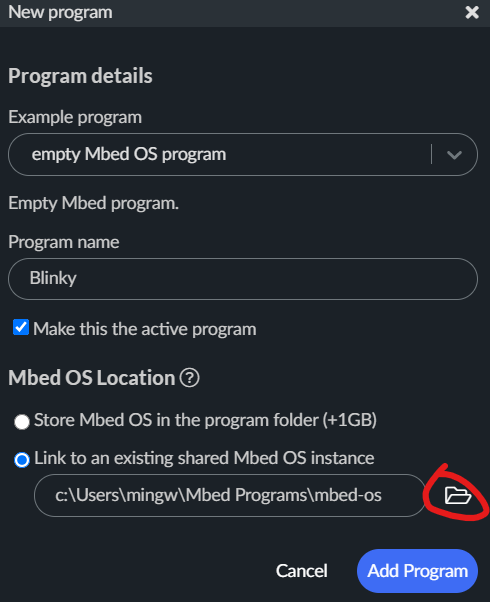
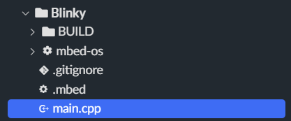
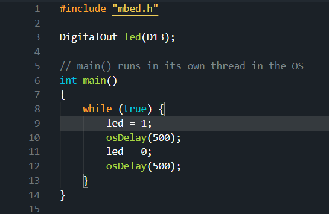
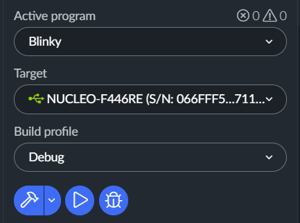

# EMBEDDED TO DO

- Discuss structure for the main mastercode - TUESDAY

- Write simple joystick-mecanum code to run infantry before we pop it into the Chassis Class - WRITTEN BUT UNTESTED

- Write a Turret Subsystem Class - WRITTEN BUT UNTESTED

- Fix position PID for M3508s

- Remove ratio option for motor constructor, if its an external gearbox have the end-user deal with it on their own.

- Add switch to the motor auto-ratio definitions instead of if-else

- Add ???? (FUCK WHAT WAS I WRITING I HAD TO GO TO THE BATHROOM 4-17-2022-2:05AM)

- Add error for trying to run position pid on the M3508s because those will never fucking work

- Remove STANDARD and make it if motor.type == C620 || C610 instead of motor.type == STANDARD.

- Make a class for Referee System 

- Look into MBED-os scheduler

# MBED STUDIO Setup

## Basic Installation

- Click this link and install [Mbed STudio](https://os.mbed.com/studio/)

- Install Github Desktop [Github Desktop](https://desktop.github.com/)

- Open Github Desktop and clone this repo to any location using this link: https://github.com/ARMmbed/mbed-os.git

## Cloning Triton Robotics Github Repo

- Clone the [TR Github](https://github.com/Triton-Robotics/TR-mbed6) with Github Desktop and PUT IT IN THE MBED PROGRAMS FOLDER. It should look like this: "C:/Users/Mbed Programs/TR-mbed6" 

## Installing a Junction

You need to create a **JUNCTION** in the TR-mbed6 folder to point to the mbed-os library. A junction is basically a glorified shortcut, except it is not the same thing.

1. Install the [Link Shell Extension](https://download.cnet.com/Link-Shell-Extension-64-bit/3000-2248_4-75213087.html)

2. Right click on the **mbed-os** folder that you cloned at the very beginning (Usually in Docuements/Github)

3. Pick Link Source on the **mbed-os** folder

4. Go inside **TR-mbed6** and right click, select **Drop As Junction**

## OPTIONAL: Setting hotkeys for building/running

Hitting the play button over and over again hurts fingies. Why not set a hotkey for it? 

1) Press ctrl+alt+comma to open the shortcuts menu

2) Search for "Run on device" 

3) Set that hotkey to "ctrl+u" (LITERALLY TYPE THAT IN)

4) Search for "Build"

5) Set that hotkey to "ctrl+r" (LITERALLY TYPE THAT IN)

**Your fingers will thank you later.......**

# Blinky Demo

Test upload code to verifiy correct installation to the STM32 Nucleo F446RE

1) Open MBED Studio

2) Go to file -> New Program

3) A window like something below will pop up
   
   1) Change example program to be an Empty MBED OS 6 Program   
   
   2) Program name: Blinky
   
   3) Click on "Link to an existing shared MBED OS instance". Select the MBED OS folder that you cloned (Documents/Github/mbed-os)
   
   4) Click Add program
   
   5) These are the steps you should take everytime you create a new, local program.
   
   

4) Open main.cpp under the Blinky program folder you just created

5) Type this code into main.cpp

6) Plug in to the Nucleo. Make sure Blinky is set to Active Program and that when you plugged into the Nucleo there is a little green USB Icon next to the name.

7) Hit the play button to compile and upload to the board. It will take some time as this is the first time you are compiling the entire project]]]

8) If you did everything right, the built-in LED should start blinking on the Nucleo!