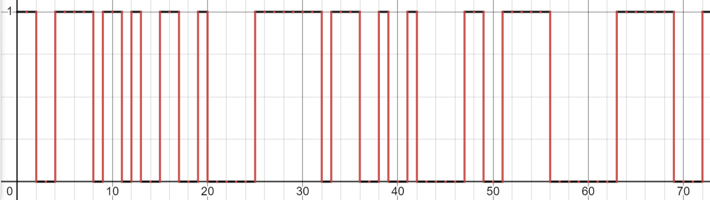
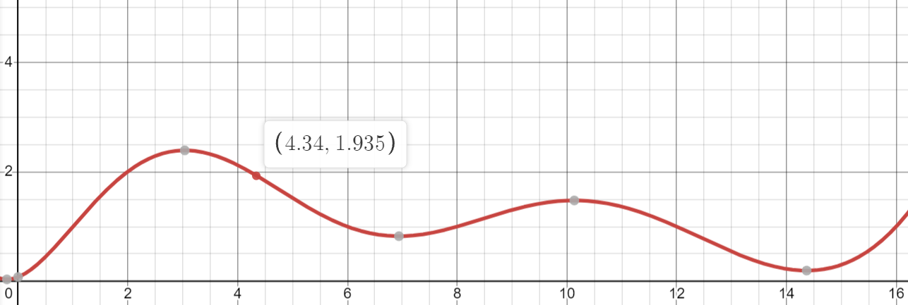

# Signals - Week 1

For all of our activities and code running, we'll be using the [ARM mbed Simulator](http://195.130.59.221/)

## Basic Signals

* A Signal can be defined as a time-varying quantity that relays some sort of
  information.

* In robotics and electrical engineering, the “quantity” we are referring to here is most often voltage. (And if not that, then current).
  
  * For the duration of this training program, a signal can be effectively thought of as a voltage that is changing over time.

* Signals are passed between devices to send and receive information. We will mostly be working with primitive data types, *integers, strings, etc.*

## Digital Signals

- Digital signals must have a finite set of possible values, but in our case we will be primarily working with binary digital signals, either high or low. In software the high is a 1, or true, and the low is a 0, or false.
  
  
  
  This signal is 1100111101101001100100000111111101110010010000011001111100000001111110001.
  
  It is very much so garbage random data, but we will be working with data that hopefully isn't.

## Analog Signals

- Analog signals are signals that are meant to be interpreted in terms of a range.
  
  
  
  For example, at time 4.34s, we can see that this voltage is 1.935V. The board can read this to a certain level of accuracy.

# 

# Exercise 1: Using Digital Signals

The mbed library allows us to very easily manipulate digital inputs and outputs. You can experiment with this using the [ARM mbed Simulator](http://195.130.59.221/). 

Creating a digital Input can be done using the `DigitalIn` Class. It is constructed as such: 

```cpp
DigitalIn input(PINNAME);
```

You can get its value the same way you would a variable

```cpp
int x = input;
```

Where `x` will be 1 if the input is high (Button pressed) and 0 if the input is low (Button unpressed).

You can also create a digital output, like an led, simply, with the `DigitalOut` Class

```cpp
DigitalOut output(PINNAME);
```

like the `DigitalIn`, the `DigitalOut` allows you to get the current value of the out by using it as a variable:

```cpp
int x = output;
```

However now you can also set the value like a variable

```cpp
output = 1; // setting the output high
```

WIth this information, write a simple program in the simulator that controls the LED with the button. the led pin is `LED1` and the button pin is `BUTTON1`. You can play around with this by pressing the button in the simulator.

# Exercise 2: Analog Input

Now let's mess around with getting our board to input analog signals. This is basically reading the voltage on a pin relative to ground. The `AnalogIn` has us covered here. `AnalogIn` functions similarly to `DigitalIn` (`AnalogOut` and `PWMOut` mirror `DigitalOut` as well)

```cpp
AnalogIn aInput(PINNAME)
double x = input;
```

However now x will be a decimal value from 0 to 1.
Using this, have an led PWM for that percentage of time. and print it out as well. 

You can use the `PWMOut` class, which as mentioned before, is similar in structure to the `DigitalOut` class, except it deals in doubles instead of ints.
